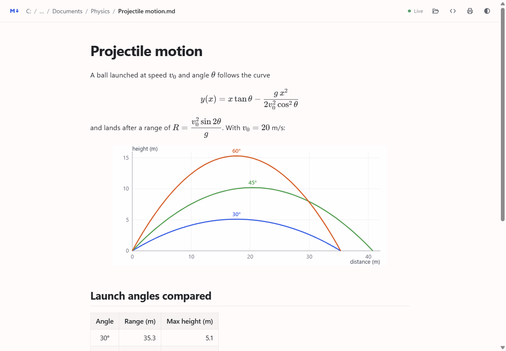
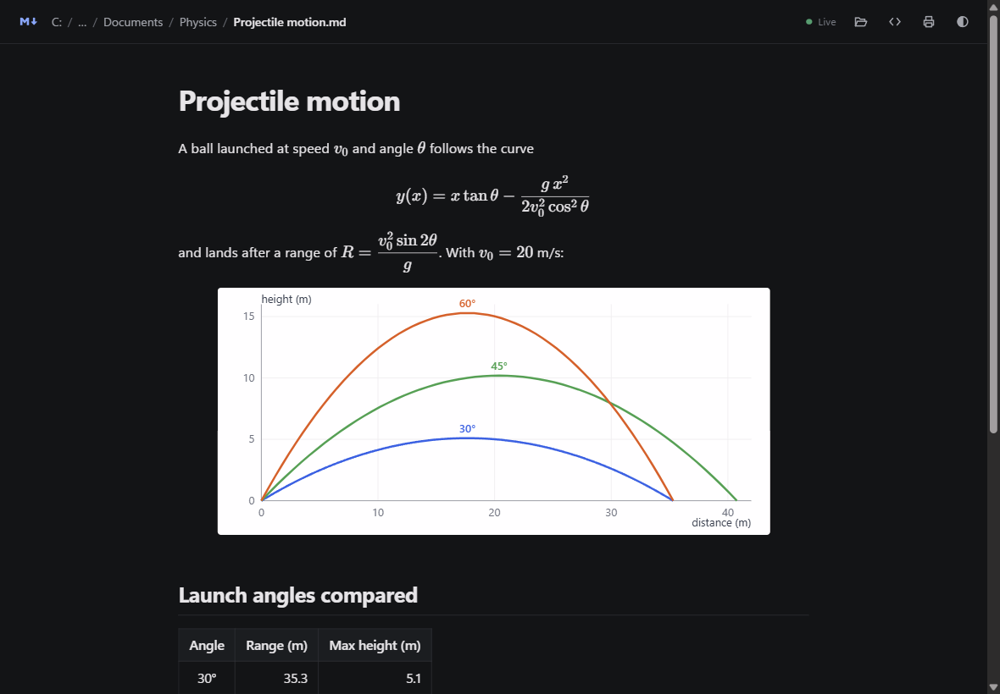

# Markdown Viewer

A small, fast Windows app for **reading** Markdown files. Double-click a `.md` file and it opens in its own window, rendered: math, tables, images and code included. When the file changes on disk, the window updates by itself.



- **Just a viewer.** No editor, no accounts, no cloud. A 0.7 MB download.
- **Nothing runs in the background.** No web server, no open ports, no polling. Close the window and it's gone.
- **Live reload.** Windows notifies the app when the file is saved, so edits show up almost instantly (about 0.2 s).
- **Math** with `$…$` and `$$…$$` (KaTeX, bundled, works offline), **GitHub-style tables, task lists and code blocks**, relative images, links between notes.
- **Light and dark** themes that follow Windows, plus a clean print layout (Ctrl+P).
- **Any language**, including Thai and other scripts, in file names and in text.



## Install

1. Download `MarkdownViewer-…-win-x64.zip` from [Releases](../../releases/latest) and extract it.
2. Double-click **`Install.cmd`**. It installs for your Windows account only; no administrator rights needed.
   Windows may say it protected your PC because the app isn't code-signed: choose **More info → Run anyway**.
3. Search **Markdown Viewer** in Start, or double-click any `.md` file.

To make it the default for `.md` files (Windows only lets you choose this yourself):
right-click a `.md` file → **Open with → Choose another app → Markdown Viewer → Always**.

**Requirements:** Windows 10 or 11 (x64). It uses the Microsoft Edge WebView2 Runtime and .NET Framework 4.8, which Windows 11 already has; on Windows 10 you may need the [WebView2 Runtime](https://go.microsoft.com/fwlink/p/?LinkId=2124703).

**Uninstall:** Settings → Apps → Installed apps → Markdown Viewer → Uninstall.

## Using it

| | |
|---|---|
| Open a file | double-click it, **Ctrl+O**, drag it onto the window, or paste its path on the home page |
| Browse a folder | click a folder in the path bar: it lists every Markdown file under it, newest first |
| Home | the **M↓** logo: recent files and your Desktop, Documents and Downloads |
| Back | **Alt+←** |
| Source | the `<>` button shows the raw Markdown |
| Print / close | **Ctrl+P** / **Ctrl+W** |

Links to other `.md` files open in the viewer. Web links open in your browser. Links to other files (PDF, images, Office documents) open in their usual app.

## How it works

`MarkdownViewer.exe` is a small C# program that shows `md.html` in [WebView2](https://learn.microsoft.com/microsoft-edge/webview2/), the Edge engine built into Windows. The page asks for files at `https://mdview.example/C:/path/to/file.md`, and the app answers those requests itself, straight from disk. This virtual address never touches the network, and nothing listens on a port. A `FileSystemWatcher` tells the page when the file changes.

Markdown is rendered by [marked](https://github.com/markedjs/marked), with a small extension for math rendered by [KaTeX](https://katex.org/).

**Security.** A Markdown file can contain HTML, so the viewer page runs under a strict Content Security Policy: only its own scripts (pinned by hash) and the bundled KaTeX may run. Scripts, inline event handlers, `javascript:` links and frames inside a document are blocked. Linked files are served with `Content-Security-Policy: sandbox`. Links to program files (`.exe`, scripts) are never run: they're shown in Explorer instead.

**Privacy.** The app has no telemetry and sends nothing anywhere. Its only network requests are for web images that a document itself embeds. It turns off the engine's background networking and SmartScreen URL checks, because web links open in your normal browser instead. The WebView2 runtime itself is part of Windows and is updated by Windows. Recent files and settings stay on your PC, in the app's folder.

## Build from source

Everything needed ships with Windows: PowerShell, `tar` and the .NET Framework C# compiler.

```powershell
powershell -ExecutionPolicy Bypass -File build.ps1
```

This downloads the pinned versions of marked, KaTeX and the WebView2 SDK into `build\cache`, then produces `dist\MarkdownViewer\` and `dist\MarkdownViewer-<version>-win-x64.zip`. Run `dist\MarkdownViewer\Install.cmd` to install your build.

| File | What it is |
|---|---|
| `src/MarkdownViewer.cs` | The app: window, in-process file handler, change watcher, install and uninstall |
| `src/md.html` | The viewer page (the build inlines marked where it says `/*@@MARKED@@*/`) |
| `assets/` | App and file icons (SVG sources and the `.ico` files built from them) |
| `build.ps1` | Downloads dependencies, compiles, packages |
| `Install.cmd` | Installer shipped in the zip |

## License

[MIT](LICENSE). The release zip also includes marked (MIT), KaTeX (MIT) and the Microsoft WebView2 SDK loader and wrappers (BSD-style); their licenses are in the `licenses` folder.
